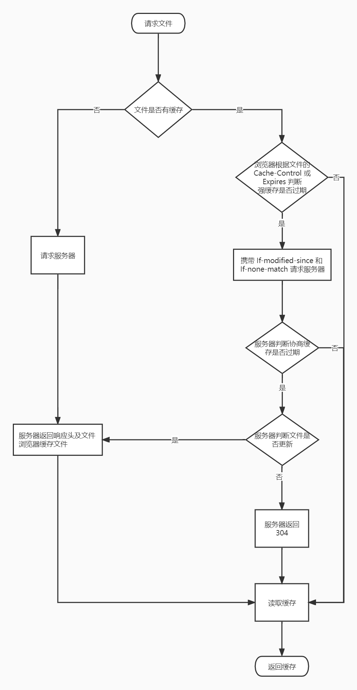

# http协议缓存

http协议缓存机制是指通过 HTTP 协议头里以下几个字段来控制文件缓存的机制。

- 强缓存
    * Cache-Control
    * Expires

- 协商缓存
    * Last-Modified/If-Modified-Since
    * Etag/If-None-Match

## Cache-control

用于控制文件在本地缓存有效时长。最常见的，比如服务器回包：Cache-Control:max-age=600 表示文件在本地应该缓存，且有效时长是600秒（从发出请求算起）。在接下来600秒内，如果有请求这个资源，浏览器不会发出 HTTP 请求，而是直接使用本地缓存的文件。

## Expires

它的值一个绝对的时间点，如：Expires: Thu, 10 Nov 2015 08:45:11 GMT，表示在这个时间点之前，缓存都是有效的。
Expires 是 HTTP1.0 标准中的字段，Cache-Control 是 HTTP1.1 标准中新加的字段，功能一样，都是控制缓存的有效时间。当这两个字段同时出现时，Cache-Control 是高优化级的。

## Last-Modified

标识文件在服务器上的最新更新时间。下次请求时，如果文件缓存过期，浏览器通过 If-Modified-Since 字段带上这个时间，发送给服务器，由服务器比较时间戳来判断文件是否有修改。如果没有修改，服务器返回304告诉浏览器继续使用缓存；如果有修改，则返回200，同时返回最新的文件。

## Etag

Etag 也是和 Last-Modified 一样，对文件进行标识的字段。不同的是，Etag 的取值是一个对文件进行标识的特征字串。在向服务器查询文件是否有更新时，浏览器通过 If-None-Match 字段把特征字串发送给服务器，由服务器和文件最新特征字串进行匹配，来判断文件是否有更新。没有更新回包304，有更新回包200。Etag 和 Last-Modified 可根据需求使用一个或两个同时使用。两个同时使用时，只要满足基中一个条件，就认为文件没有更新。

## 注意点

Cache-Control 通常与 Last-Modified 一起使用。一个用于控制缓存有效时间，一个在缓存失效后，向服务查询是否有更新。

## 特殊情况

### 手动刷新页面（F5)

浏览器会直接认为缓存已经过期（可能缓存还没有过期），在请求中加上字段：Cache-Control:max-age=0，发包向服务器查询是否有文件是否有更新。

### 强制刷新页面（Ctrl+F5)

浏览器会直接忽略本地的缓存（有缓存也会认为本地没有缓存），在请求中加上字段：Cache-Control:no-cache（或 Pragma:no-cache），发包向服务重新拉取文件。

## 图解

